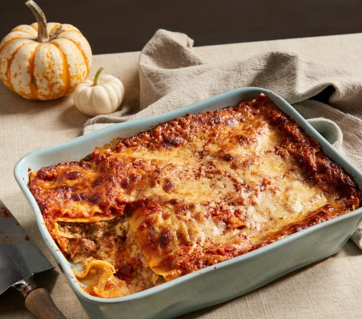
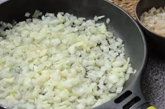
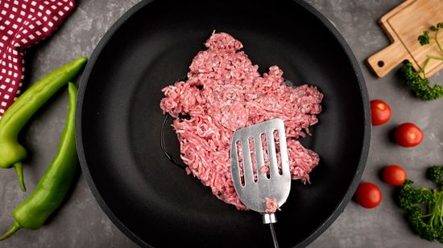

# Receta de Lasagna de Carne:
Esta guia se trata sobre como hacer una rica lasagna de carne en tu casa.
Puede consultar estos links, los cuales tambien contiene diferentes maneras de hacer lasagna!:
[CLICK AQUÍ](https://www.bbcgoodfood.com/recipes/classic-lasagne-0)
2- [CLICK AQUÍ](https://www.spendwithpennies.com/easy-homemade-lasagna/)
3- [CLICK AQUÍ](https://www.allrecipes.com/recipe/23600/worlds-best-lasagna/)
4- [CLICK AQUÍ](https://www.simplyrecipes.com/recipes/lasagna/)
5- [CLICK AQUI](https://www.youtube.com/watch?v=QZloaLmvSP0&ab_channel=PreppyKitchen)

# Ingredientes:

- 1 paquete de láminas de lasaña
- 500g de carne picada
- 1 cebolla grande, picada
- 3 dientes de ajo, picados
- 800g de tomate triturado en lata
- 2 cucharadas de pasta de tomate
- 1 cucharadita de azúcar
- 2 cucharaditas de orégano seco
- 1 cucharadita de albahaca seca
- Sal y pimienta al gusto
- 250g de queso ricotta
- 1 huevo
- 100g de queso parmesano rallado
- 300g de mozzarella rallada
- Aceite de oliva
- Hojas de albahaca fresca para decorar

# Instrucciones:

1. Precalentá el horno a 180°C (350°F).

2. En una sartén grande, calentá un poco de aceite de oliva a fuego medio. Agregá la cebolla y el ajo picados y cocínalos hasta que estén transparentes.

3. Agregá la carne molida a la sartén y cocinala hasta que esté bien dorada y cocida por completo. Escurrí el exceso de grasa si es necesario.

4. Añadí el tomate triturado, la pasta de tomate, el azúcar, el orégano, la albahaca, la sal y la pimienta a la sartén. Mezclá bien y dejá que la salsa hierva a fuego lento durante unos 15-20 minutos, revolviendo ocasionalmente.

5. En un tazón pequeño, mezclá el queso ricotta con el huevo batido y la mitad del queso parmesano rallado.

6. En una bandeja para hornear, extendé una capa fina de salsa de carne en el fondo. Colocá una capa de láminas de lasaña sobre la salsa, asegurándote de que no se superpongan.

7. Extendé una capa de la mezcla de queso ricotta sobre las láminas de lasaña. Luego, esparcí una capa de salsa de carne por encima. Tira un poco de mozzarella rallada.

8. Repetí el proceso, alternando capas de láminas de lasaña, mezcla de queso ricotta, salsa de carne y mozzarella rallada, hasta que hayas usado todos los ingredientes.

9. Cubrí la última capa de lasaña con salsa de carne y espolvorea el queso parmesano rallado restante por encima.

10. Cubrí la bandeja para hornear con papel de aluminio y hornea la lasaña en el horno precalentado durante unos 30 minutos.

11. Retirá el papel de aluminio y hornea por otros 10-15 minutos, o hasta que la lasaña esté burbujeante y dorada en la parte superior.

12. Dejá reposar la lasaña durante unos minutos antes de cortarla en porciones. Decorá con hojas de albahaca fresca y sirve caliente.

# Pumba, una rica lasagna de carne te hiciste :).

